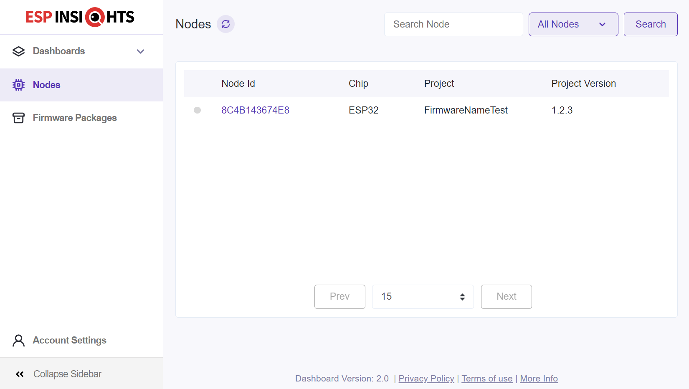

# ESP-Insights with arduino-esp32 framework example 

This is a working example that uses ESP-Insights component added into arduino-esp32 framework.

You will need to configure the src/main.cpp file to add your wifi credentials and the Esp-Insights Auth Key

There are some platformio scripts running before and after the build process that help to engrave the necessary information required to setup ESP-Insights and create the firmware zip package to upload to the ESP-Insights dashboard. The zip file will be created after platformio build under .pio/esp32 folder. More info can be found in this issue: https://github.com/espressif/esp-insights/issues/14

Check platformio.ini file to configure the project name and version that it will appear on the esp-insights node description:

```` ini
; ESP-Insight Firmware data configurations for the scripts:
custom_prog_name = FirmwareNameTest
custom_prog_version = 1.2.3
````




* https://github.com/espressif/esp32-arduino-lib-builder/pull/99
* https://github.com/platformio/platform-espressif32/pull/973